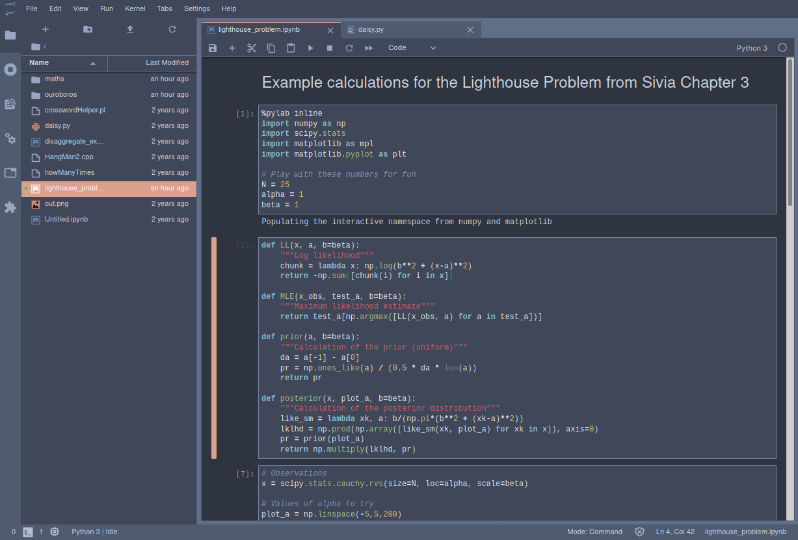
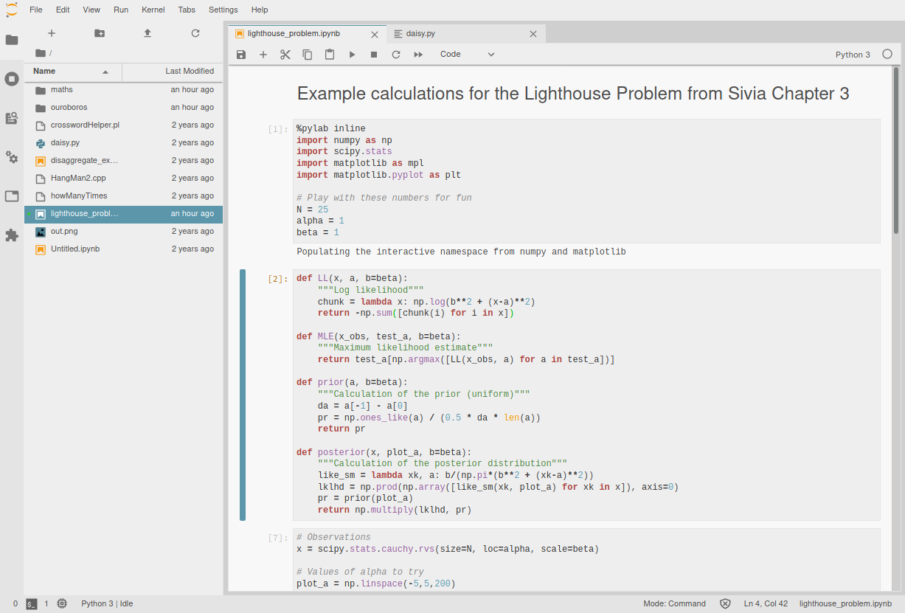

# jupyterlab-themes

## Add more colors to your Jupyter Lab!

:exclamation: This plugin is in super-duper-pre-early-alpha stages. You are welcome to try to use and/or improve it,
 but I can't vouch for it's stability. If you want to help out, check out the contributing section below, or browse the
 issues!

## What is this?
Simply put, this is an extension to add a number of color themes to Juptyer Lab. I created this as a heavy user of
Jupyter Lab, and didn't particularly like the default dark scheme. I take *heavy* inspriation from the following
projects:

 - [base16](https://github.com/chriskempson/base16): Definitions of color schemes following a basic template
 - [jupyter-themes](https://github.com/dunovank/jupyter-themes): Themes for jupyter notebook
 - [theme-gruvbox](https://github.com/Rahlir/theme-gruvbox): gruvbox dark theme implemented for Jupyter Lab

## Installation
Currently, you have to install each of the themes individually. Lagging versions can be installed directly
via `npm` with the standard way of installing lab extensions:

```
jupyter labextension install @arbennett/base16-{$themename}
```

However, you might have better and more complete results if you build from source and link directly from
source until things have settled down. This can be accomplished by running the following comands in a
theme's respective subdirectory:

```
npm install
jupyter labextension link .
```

## Example screenshots

### Nord theme


### Mexico theme


## Contributing
I am only able to work on this project intermittently, and would love to make this a community project.
If you would like to contribute feel free to open a pull request or file an issue! I'll do my best to
respond to PRs and issues as quickly as possible, and will probably prioritize that over doing more
development of my own.

### My workflow
Because I am not a web developer, my familiarity with javascript and typescript is somewhat limited.
Thus, the workflow I've developed here may seem odd or convoluted to those with more experience in this
domain. Basically, my workflow has been to edit the base stylesheets in the `scss` directory, and using the
`gen_css.sh` script to generate all of the `css` files directly. Then I update my builds as necessary.
If you know a better way to do this, please let me know!
